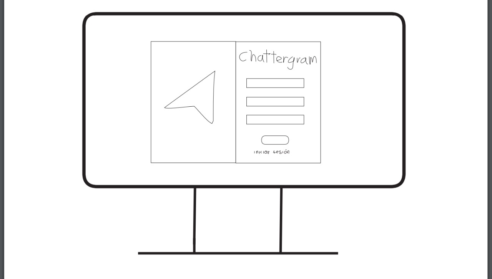
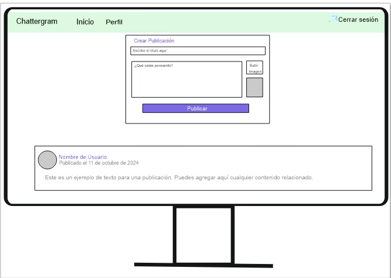
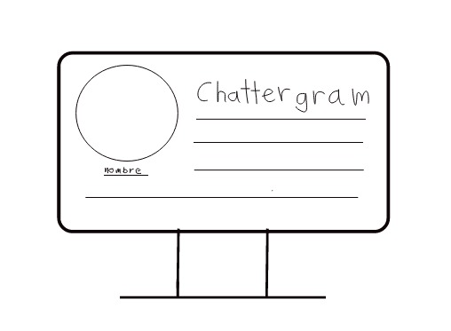

# 💯💯 CHATTERGRAM 💯💯 

Chattergram es una innovadora red social que permite a los usuarios conectarse, comunicarse y compartir experiencias de manera única. Diseñada para facilitar interacciones significativas, Chattergram combina una interfaz intuitiva con potentes funcionalidades para crear un entorno social atractivo y dinámico.

## Características📜📜
Interfaz Amigable: Navegación sencilla y atractiva que mejora la experiencia del usuario.
Registro y Autenticación: Los usuarios pueden crear cuentas y gestionar su información de manera segura.
Publicaciones y Mensajes: Comparte contenido y comunica con amigos de forma rápida y efectiva.
Conexiones: Encuentra y sigue a amigos y familiares para mantenerte en contacto.
- **Interfaz Amigable:** Navegación sencilla y atractiva que mejora la experiencia del usuario.
- **Registro y Autenticación:** Los usuarios pueden crear cuentas y gestionar su información de manera segura.
- **Publicaciones y Mensajes:** Comparte contenido y comunica con amigos de forma rápida y efectiva.
- **Conexiones:** Encuentra y sigue a amigos y familiares para mantenerte en contacto.

## Prototipos

### Prototipo de Alta Fidelidad 💻

Pagina de Inicio de Seción

Pagina principal

Pagina de perfil

### Prototipo de Baja Fidelidad 📝

| Página Principal | Página de Selección |  Página de Perfil   |
| ---------------- | -------------------- | -------------------  |
|  |  | 

| Selección | Detalles |
| ---------- | ------- |
|  |  |
## Tecnologías Utilizadas

A continuación, se muestran las tecnologías utilizadas en el desarrollo de Chattergram:

## 👩‍💻👩‍💻Creado por: 

* [Mishell Arroyo](https://github.com/Mishell-A)
* [Oriana](https://github.com/ori27-ops)
* [Brizett-TB](https://github.com/Brizett-TB)
* [GuadalupeCampos](https://github.com/GuadalupeCampos)
* [guadalupe56-dot](https://github.com/guadalupe56-dot)
